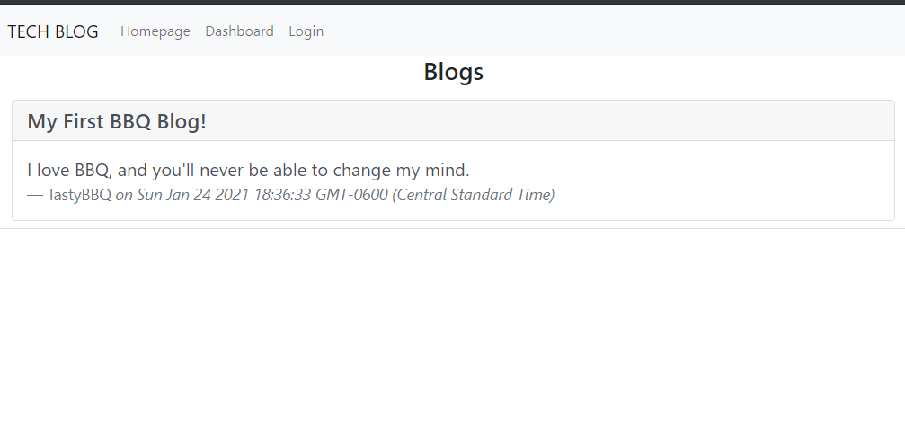

# Tech Blog

My name is Julian. Welcome to my Tech Blog node app.

## Description

A site for posting blog notes and comments

## Table of Contents

- [Tech Blog](#tech-blog)
  - [Description](#description)
  - [Table of Contents](#table-of-contents)
  - [Language(s)](#languages)
  - [Installation](#installation)
  - [Usage](#usage)
  - [Contributing](#contributing)
  - [Tests](#tests)
  - [License](#license)
  - [Questions](#questions)
  - [Comments](#comments)

## Language(s)

Language(s) used in this project:
HTML,CSS,JavaScript

## Installation

> Clone repo `git@github.com:Calterat/tech-blog` and navigate into new directory. Install all packages with `npm install`. Set up the database tables by logging into your MySQL server and `source db/schema.sql`. Exit out of the MySQL server and start the server with `npm start`. Open up your browser and go to address `localhost:3001`. Navigate the site and start blogging away!

## Usage

> This app will allow you to start blog conversations and comment on them. Gather with like minded tech enthusiasts!

        

## Contributing

> Help yourself to cloning, branching, and requestin a pull!
 

## Tests

> N/A

## License

This project is covered under the license of [MIT License](https://GitHub.com/Calterat/tech-blog/main/LICENSE)

## Questions

You can find my home repo [here](https://GitHub.com/Calterat).

Here is the link to the application's [site](https://immense-thicket-93498.herokuapp.com/)'s site.
         

If you have additional questions, you may reach me at my E-mail Address: Calterat@gmail.com

## Comments

> This README is generated from another one of my apps! Check it out [here](https://github.com/Calterat/readme-generator)!

